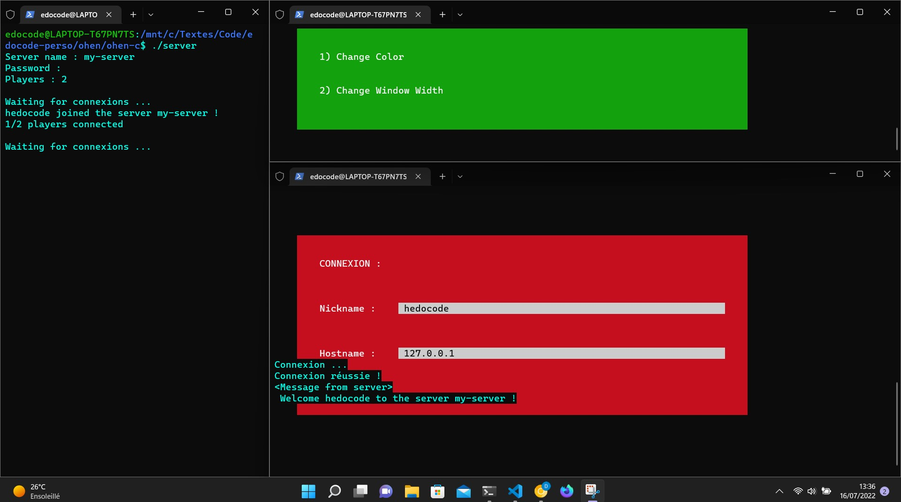
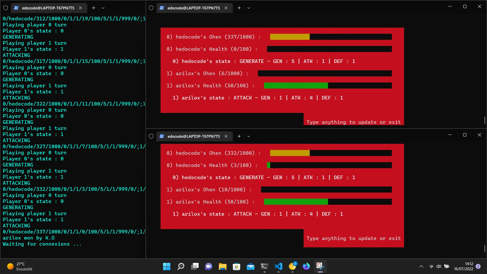

# ohen
Little C network game (CLI).


## Prerequierements

```
apt-get install gcc
```

```
apt-get install make
```


## Install

```
make all
```


## Launch client

```
./client
```


## Launch Server

```
./server
```


## Screenshots


